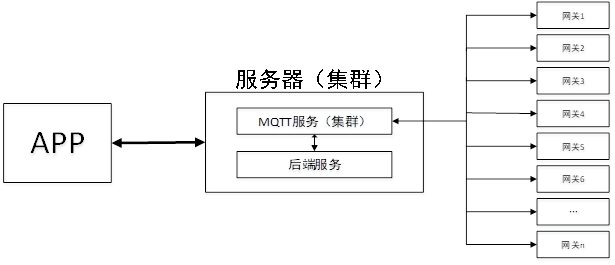
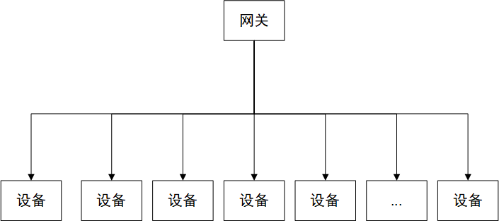
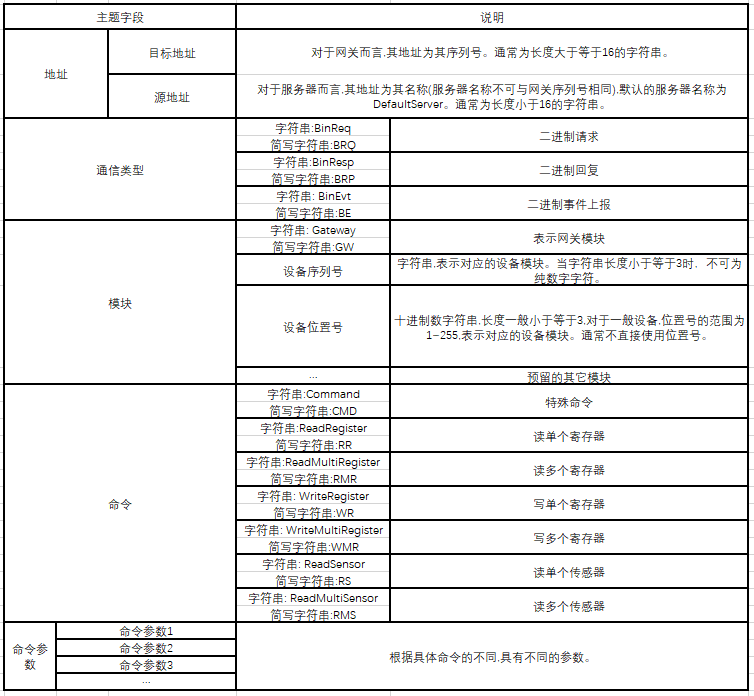

# 网络架构

网关与服务器之间采用MQTT协议，因此服务器应当运行MQTT服务。当前的服务器采用的是用EMQX搭建的MQTT服务。

整个架构中,服务器的后端服务及网关均连接至MQTT服务进行订阅与发布,为了区分二者的不同,下文中如无特殊说明,客户端一般指网关设备，服务端一般指后端服务。

每个网关可带若干设备,通过各种协议与设备进行通信。

# 服务器服务说明

MQTT Broker及其集群提供MQTT消息转发服务。连接MQTT Broker主要的参数为服务器IP地址(或者域名)、TCP端口号。若需启用SSL/TLS,则还需要CA证书、客户端证书、客户端证书密钥，其中客户端证书与客户端证书密钥仅当MQTT Broker启用了双向认证时才需要。

对于服务端(即后端服务)而言,可采用固定的服务器IP地址(或者域名)及TCP端口号。若后端程序与MQTT Broker运行在同一台服务器中(适用于设备数量较小的内网),可采用localhost作为服务器地址,并且需要MQTT Broker给服务器专门开设端口且只绑定到localhost。若后端程序与MQTT Broker不运行在同一台服务器,则必须启用SSL/TLS并使用双向认证。

| 测试服务器域名    | 说明                   |
| ----------------- | ---------------------- |
| mqtt.hyhsystem.cn | 默认的服务器(优先使用) |

# MQTT连接参数

对于MQTT版本,客户端连接MQTT时应尽可能使用MQTT V3.1.1,服务端任意选取支持的版本。若新版本中的新特性未在此章节说明,则使用默认的连接参数。若能够启用SSL/TLS传输,则应当启用SSL/TLS传输。

MQTT的主要连接参数为:ClientID、Username、Password、CleanSession、Keepalive。ClientID为MQTT客户端ID,具有唯一性。Username为用户名,Password为密码,二者配合使用。CleanSession表示是否重新启用干净的会话,通常设置为True(即1)。Keepalive为MQTT的保活机制,通常需要启用。遗嘱消息等内容在后续章节中说明。

##  服务端连接参数

| 项目         | 说明                                             |
| ------------ | ------------------------------------------------ |
| ClientID     | 服务器名称,但若有多台服务器,服务器名称应当不同。 |
| Username     | 可不使用                                         |
| Password     | 可不使用                                         |
| CleanSession | True(1)                                          |
| Keepalive    | 启用,通常为120s                                  |

以上为服务端的测试连接参数,可根据实际情况进行调整。如MQTT集群启用了什么认证就需要调整什么连接参数。

 

##  客户端连接参数

| 项目         | 说明                                                         |
| ------------ | ------------------------------------------------------------ |
| ClientID     | 网关序列号                                                   |
| Username     | 同ClientID                                                   |
| Password     | 如不启用认证,同ClientID,如启用认证,则应当为使用某种加密后(加密内容包括时间)的Base64编码的字符串。 |
| CleanSession | True(1)                                                      |
| Keepalive    | 启用,通常为120s                                              |

以上为客户端的测试连接参数, 可根据实际情况进行轻微调整。如MQTT集群启用了什么认证就需要调整什么连接参数。

#  MQTT消息格式

##  消息主题(topic)

主题格式为: [目的地址]/[源地址]/[通信类型]/[模块]/[命令]/[命令参数1]/[命令参数2]/[命令参数3]/…,为防止主题溢出,最大主题长度为128字节。主题中的字母均需要区分大小写。

  

具体主题根据操作类型的不同而略有不同。如当通信类型为BinEvt时,模块只能为Gateway(网关模块)或者设备序列号(设备模块),命令只能为Command。

所有字段若有简写形式，那么在通信过程中必须使用简写形式，非简写形式仅用于文档编辑或者程序编写(取函数名)。正常情况下,BinReq与BinResp均应成对出现。当进行BinEvt上报时,所有的主题字段均应当使用简写形式,模块字段应当使用设备序列号。

默认的服务器名称为DefaultServer,如只有一个服务端(即后端服务),则无需使用另外的名称。客户端回复时目的地址为服务端请求时的源地址,源地址为自身序列号。当客户端进行上报操作时,目的地址为默认的服务器名称。

网关序列号与设备序列号通常作为网关与设备的唯一标识，可具体区分到某一个网关与设备。序列号通常可在出厂时烧录，若芯片具有唯一性的数据，如MAC地址、芯片序列号等，可通过一系列算法生成自身序列号。 

## 负载数据(payload)

负载数据通常根据主题的不同含义不同,但负载数据中的某些字段可能在多个主题中出现,下面将对一些常用的负载数据中的字段进行说明。

| 字段名称   | 字节数 | 说明                          |
| ---------- | ------ | ----------------------------- |
| 返回值     | 1      | 适用于通信类型为BinResp的主题 |
| 寄存器地址 | 2      | 适用于与寄存器相关的命令      |
| 寄存器标志 | 1      | 标识寄存器属性                |
| 传感器地址 | 2      | 适用于与传感器相关的命令      |
| 传感器标志 | 1      | 标识传感器属性                |
| 命令ID     | 2      | 适用于与特殊命令相关的命令    |

###  返回值

返回值作为网关对命令执行状态的反馈,在所有命令的回复中均有出现。

| 返回值(16进制) | 说明                         |
| -------------- | ---------------------------- |
| 0              | 命令执行成功                 |
| 1              | 通信类型不支持               |
| 2              | 模块不存在                   |
| 3              | 模块存在但处于无效状态(离线) |
| 4              | 命令/命令参数出现错误        |
| 5              | 命令负载数据有误             |
| 6              | 命令执行被拒绝               |
| 7              | 通信错误                     |
| 80~FE          | 具体命令的特殊错误           |
| FF             | 未知错误                     |

 

### 寄存器地址

寄存器地址占用2字节,小端模式。在以下命令中使用: ReadRegister、ReadMultiRegister、WriteRegister、WriteMultiRegister。 

### 寄存器标志

寄存器标志占用1字节。在以下命令中使用: ReadRegister、ReadMultiRegister、WriteRegister、WriteMultiRegister。

| 位0  | 寄存器长度位0。  0=1字节,1=2字节,2=4字节,3=8字节 |
| ---- | ------------------------------------------------ |
| 位1  | 寄存器长度位1。                                  |
| 位2  | 保留                                             |
| 位3  | 是否不允许缓存。0=自动(由网关决定),1=不允许      |
| 位4  | 保留                                             |
| 位5  | 保留                                             |
| 位6  | 保留                                             |
| 位7  | 只读位,1=只读,0=可读写                           |

 

###  传感器地址

传感器地址占用2字节,小端模式。在以下命令中使用: ReadSensor、ReadMultiSensor。 

###  传感器标志

传感器标志占用1字节。在以下命令中使用: ReadSensor、ReadMultiSensor。 

| 位0  | 传感器数据长度位0。  0=1字节,1=2字节,2=4字节,3=8字节         |
| ---- | ------------------------------------------------------------ |
| 位1  | 传感器数据长度位1。                                          |
| 位2  | 保留                                                         |
| 位3  | 是否不允许缓存。0=自动(由网关决定),1=不允许                  |
| 位4  | 定点数系数位0。  表示以10为底的幂。如0=系数为1，1=系数为10，2=系数为100 |
| 位5  | 定点数系数位1                                                |
| 位6  | 定点数系数位2                                                |
| 位7  | 符号位,1=有符号数,0=无符号数                                 |

 

传感器数据在传输过程中为整数,小端模式。传感器的实际值多数情况下为小数,因此需要进行定点数的换算。                        

### 命令ID

命令ID占用2字节,小端模式。适用于以下命令：Command 

## 命令

### 特殊命令

特殊命令用于执行特殊操作,每个操作通过命令ID区分不同的Command。

特殊命令支持以下通信类型: BinReq、BinResp、BinEvt。其中BinReq一般用于服务端向客户端请求(payload为二进制数据),BinResp一般用于客户端向服务端回复(payload为二进制数据)，BinEvt一般用于客户端主动向服务端上报(payload为二进制数据)。

特殊命令可带命令参数,也可不带命令参数,命令参数可作为某种情况下的辅助过滤依据,具体根据模块的不同与命令ID的不同有所不同。 

#### 二进制请求

BinReq用于服务端向客户端发送命令请求,命令格式根据用途的不同而不同。其payload主要格式如下:

| 2字节  | 多个字节 |
| ------ | -------- |
| 命令ID | 数据     |

#### 二进制回复

BinResp用于客户端向服务端发送请求回复,命令格式根据用途的不同而不同。其payload主要格式如下:

| 2字节  | 1字节  | 多个字节 |
| ------ | ------ | -------- |
| 命令ID | 返回值 | 数据     |

#### 二进制上报

BinEvt用于客户端向服务端发送上报数据,命令格式根据用途的不同而不同。其payload主要格式如下:

| 2字节  | 多个字节 |
| ------ | -------- |
| 命令ID | 数据     |

###  读单个寄存器

读单个寄存器用于读取单个寄存器值。

读单个寄存器支持以下通信类型: BinReq、BinResp。其中BinReq一般用于服务端向客户端请求(payload为二进制数据),BinResp一般用于客户端向服务端回复(payload为二进制数据)。

读单个寄存器一般不带带命令参数。 

#### 二进制请求

请求时,其payload格式如下:

| 2字节      |
| ---------- |
| 寄存器地址 |

#### 二进制回复

回复时,其payload格式如下:

| 1字节  | 2字节      | 1字节      | N字节                          |
| ------ | ---------- | ---------- | ------------------------------ |
| 返回值 | 寄存器地址 | 寄存器标志 | 寄存器值(长度由寄存器标志确定) |

当出现异常时,根据实际情况可不包含寄存器标志与寄存器值字段。若返回值不为0，payload可只包含返回值。

寄存器值为整数，小端模式。若寄存器不存在,可将寄存器标志和寄存器值置为0。

### 读多个寄存器

读多个寄存器用于读取多个寄存器值。

读多个寄存器支持以下通信类型: BinReq、BinResp。其中BinReq一般用于服务端向客户端请求(payload为二进制数据),BinResp一般用于客户端向服务端回复(payload为二进制数据)。

读多个寄存器一般不带带命令参数。 

#### 二进制请求

请求时,其payload格式如下:

| 2字节            | 2字节              |
| ---------------- | ------------------ |
| 寄存器地址(起始) | 待读取的寄存器个数 |

#### 二进制回复

回复时,其payload格式如下:

| 1字节  | …           | …           | …    | …           |
| ------ | ----------- | ----------- | ---- | ----------- |
| 返回值 | 寄存器返回1 | 寄存器返回2 | …    | 寄存器返回N |

若返回值不为0，payload可只包含返回值。读取几个寄存器返回几个寄存器返回。

Payload中寄存器返回的格式如下:

| 2字节      | 1字节      | N字节                          |
| ---------- | ---------- | ------------------------------ |
| 寄存器地址 | 寄存器标志 | 寄存器值(长度由寄存器标志确定) |

寄存器值为整数，小端模式。若寄存器不存在,可将寄存器标志和寄存器值置为0。

### 写单个寄存器

写单个寄存器用于写单个寄存器值。

写单个寄存器支持以下通信类型: BinReq、BinResp。其中BinReq一般用于服务端向客户端请求(payload为二进制数据),BinResp一般用于客户端向服务端回复(payload为二进制数据)。

写单个寄存器一般不带带命令参数。 

#### 二进制请求

请求时,其payload格式如下:

| 2字节      | 1字节      | N字节                          |
| ---------- | ---------- | ------------------------------ |
| 寄存器地址 | 寄存器标志 | 寄存器值(长度由寄存器标志确定) |

其中,寄存器标志中仅用于指示寄存器值长度。

寄存器值为整数，小端模式。

#### 二进制回复

回复时,其payload格式如下:

| 1字节  | 2字节      | 1字节      | N字节                          |
| ------ | ---------- | ---------- | ------------------------------ |
| 返回值 | 寄存器地址 | 寄存器标志 | 寄存器值(长度由寄存器标志确定) |

当出现异常时,根据实际情况可不包含寄存器标志与寄存器值字段。若返回值不为0，payload可只包含返回值。

寄存器值为整数，小端模式。寄存器值表示写入后的值，通常与写入值相同,若寄存器不存在,可将寄存器值与寄存器标志置为0。

### 写多个寄存器

写多个寄存器用于写入多个寄存器值。

写多个寄存器支持以下通信类型: BinReq、BinResp。其中BinReq一般用于服务端向客户端请求(payload为二进制数据),BinResp一般用于客户端向服务端回复(payload为二进制数据)。

写多个寄存器一般不带带命令参数。 

####  二进制请求

请求时,其payload格式如下：

| …           | …           | …    | …           |
| ----------- | ----------- | ---- | ----------- |
| 寄存器设置1 | 寄存器设置2 | …    | 寄存器设置N |

其中,寄存器设置的格式如下:

| 2字节      | 1字节      | N字节                          |
| ---------- | ---------- | ------------------------------ |
| 寄存器地址 | 寄存器标志 | 寄存器值(长度由寄存器标志确定) |

其中,寄存器标志中仅用于指示寄存器值长度。

寄存器值为整数，小端模式。 

#### 二进制回复

回复时,其payload格式如下:

| 1字节  | …               | …               | …    | …               |
| ------ | --------------- | --------------- | ---- | --------------- |
| 返回值 | 寄存器设置返回1 | 寄存器设置返回2 | …    | 寄存器设置返回N |

若返回值不为0，payload可只包含返回值。

其中,寄存器设置返回的格式如下:

| 2字节      | 1字节      | N字节                          |
| ---------- | ---------- | ------------------------------ |
| 寄存器地址 | 寄存器标志 | 寄存器值(长度由寄存器标志确定) |

寄存器值为整数，小端模式。寄存器值表示写入后的值，通常与写入值相同,若寄存器不存在,可将寄存器值与寄存器标志置为0。

### 读单个传感器

读单个传感器用于读取单个传感器值。

读单个传感器支持以下通信类型: BinReq、BinResp。其中BinReq一般用于服务端向客户端请求(payload为二进制数据),BinResp一般用于客户端向服务端回复(payload为二进制数据)。

读单个传感器一般不带带命令参数。 

#### 二进制请求

请求时,其payload格式如下:

| 2字节      | 1字节      |
| ---------- | ---------- |
| 传感器地址 | 传感器标志 |

####  二进制回复

回复时,其payload格式如下:

| 1字节  | 2字节      | 1字节      | N字节                          |
| ------ | ---------- | ---------- | ------------------------------ |
| 返回值 | 传感器地址 | 传感器标志 | 传感器值(长度由寄存器标志确定) |

 

当出现异常时,根据实际情况可不包含传感器标志与传感器值字段。若返回值不为0，payload可只包含返回值。

传感器值为整数,小端模式。若传感器不存在,可将传感器值置为0。

注意:回复可不按照请求时的传感器标志进行，网关可按照自己需要回复。

### 读多个传感器

读多个传感器用于读取多个传感器值。

读多个传感器支持以下通信类型: BinReq、BinResp。其中BinReq一般用于服务端向客户端请求(payload为二进制数据),BinResp一般用于客户端向服务端回复(payload为二进制数据)。

读多个传感器一般不带带命令参数。 

#### 二进制请求

请求时,其payload格式如下：

| …           | …           | …    | …           |
| ----------- | ----------- | ---- | ----------- |
| 传感器请求1 | 传感器请求2 | …    | 传感器请求N |

其中,传感器请求的格式如下:

| 2字节      | 1字节      |
| ---------- | ---------- |
| 传感器地址 | 传感器标志 |

####  二进制回复

回复时,其payload格式如下:

| 1字节  | …               | …               | …    | …               |
| ------ | --------------- | --------------- | ---- | --------------- |
| 返回值 | 传感器请求返回1 | 传感器请求返回2 | …    | 传感器请求返回N |

若返回值不为0，payload可只包含返回值。

其中,传感器请求返回结构如下:

| 2字节      | 1字节      | N字节                          |
| ---------- | ---------- | ------------------------------ |
| 传感器地址 | 传感器标志 | 传感器值(长度由寄存器标志确定) |

传感器值为整数，小端模式。若传感器不存在,可将传感器值置为0。

注意:回复可不按照请求时的传感器标志进行，网关可按照自己需要回复。

## 模块

模块通常用于区分网关硬件上的功能,若访问不属于某一个设备的功能,应当使用网关模块,若向访问某个网关下的设备的功能,应当使用某个具体设备模块。

模块的主要软件资源有命令ID、寄存器地址与传感器地址。这些软件资源在具体硬件上会映射到某个具体功能。具体实现需要在具体硬件的描述中。

对于某些共有的功能,则映射到保留资源上。这些保留资源不属于某一个或者某一类硬件,而是属于所有使用本协议的硬件。不同类型的模块保留参数不同,如网关模块与设备模块就有不同的保留软件资源。

### 网关模块保留资源

| 保留资源名称 | 范围          | 说明 |
| ------------ | ------------- | ---- |
| 命令ID       | 0x0000~0x0FFF |      |
| 寄存器地址   | 0x0000~0x0FFF |      |

保留资源主要用于共有的功能。

下表为映射在保留资源的特殊命令表:

| 命令ID(16进制) | 说明               |
| -------------- | ------------------ |
| 0000           | 网关上线           |
| 0001           | 网关下线           |
| 0002           | 查询网关名称       |
| 0003           | 查询网关序列号     |
| 0004           | 网关上线上报设备表 |
| 0005           | 网关上报设备表变动 |
| 0006           | 查询网关设备表     |
| 0007           | 查询网关设备表列表 |

####  网关上线

网关上线消息为网关成功连接MQTT的第一条消息。用于通知服务器网关已上线。

通信类型:BinEvt

命令类型:特殊命令

命令参数1:online

命令ID:0x0000

上报Payload格式:

| 2字节  |
| ------ |
| 命令ID |

#### 网关下线

网关下线消息为网关断开MQTT服务后的消息。通常通过遗嘱消息实现。

通信类型:BinEvt

命令类型:特殊命令

命令参数1:offline

命令ID:0x0001

上报Payload格式:

| 2字节  |
| ------ |
| 命令ID |

####  查询网关名称

查询网关名称由后端服务发起请求,网关回复请求。

通信类型:BinReq、BinResp

命令类型:特殊命令

命令ID:0x0002

二进制请求payload格式:

| 2字节  |
| ------ |
| 命令ID |

二进制回复payload格式:

| 2字节  | 1字节  | N字节    |
| ------ | ------ | -------- |
| 命令ID | 返回值 | 网关名称 |

其中,网关名称应当以\0字符结尾。

#### 查询网关序列号

查询网关序列号由后端服务发起请求,网关回复请求。

通信类型:BinReq、BinResp

命令类型:特殊命令

命令ID:0x0003

二进制请求payload格式:

| 2字节  |
| ------ |
| 命令ID |

二进制回复payload格式:

| 2字节  | 1字节  | N字节      |
| ------ | ------ | ---------- |
| 命令ID | 返回值 | 网关序列号 |

其中,网关序列号应当以\0字符结尾。 

#### 网关上线上报设备表

网关上线上报设备表由网关成功连接MQTT后上报,每个存在于设备表的设备(不管是否处于在线)上报一次。若设备表无设备,则无需上报。

通信类型:BinEvt

命令类型:特殊命令

命令ID:0x0004

二进制请求payload格式:

| 2字节  | 1字节      | N字节      |
| ------ | ---------- | ---------- |
| 命令ID | 设备位置号 | 设备序列号 |

其中, 设备序列号应当以\0字符结尾。 

#### 网关上报设备表变动

网关上报设备表变动表示网关成功执行添加或者删除设备后主动上报设备信息。对于某些网关而言,可只实现添加设备后上报,删除设备后上报为可选操作。此上报操作必须在操作完成的当时进行上报,其它时刻无需上报,如网关初始化过程无需此上报。

通信类型:BinEvt

命令类型:特殊命令

命令ID:0x0005

二进制请求payload格式:

| 2字节  | 1字节      | 1字节    | N字节      |
| ------ | ---------- | -------- | ---------- |
| 命令ID | 设备位置号 | 上报类型 | 设备序列号 |

其中,上报类型为0时,表示这是删除设备操作后的上报,上报类型为1时,表示这是添加设备后的上报,上报类型为2时,表示遇到异常情况,设备序列号需要更新。设备序列号应当以\0字符结尾。 

#### 查询网关设备表

查询网关设备表由后端服务发起请求,网关回复请求。后端服务可通过查询网关设备表获得设备状态及设备序列号。

通信类型:BinReq、BinResp

命令类型:特殊命令

命令ID:0x0006

二进制请求payload格式:

| 2字节  | 1字节      |
| ------ | ---------- |
| 命令ID | 设备位置号 |

二进制回复payload格式:

| 2字节  | 1字节  | 1字节      | 1字节        | N字节      |
| ------ | ------ | ---------- | ------------ | ---------- |
| 命令ID | 返回值 | 设备位置号 | 设备在线状态 | 设备序列号 |

其中,设备在线状态为0时表示设备离线,设备状态为1时表示设备在线。设备序列号应当以\0字符结尾。当查询的设备不存在时,设备在线状态应当为0，且设备序列号应当为空。 

#### 查询网关设备表列表

查询网关设备表列表由后端服务发起请求,网关回复请求。后端服务可通过查询网关设备表列表获取已经使用的设备位置号。

通信类型:BinReq、BinResp

命令类型:特殊命令

命令ID:0x0007

二进制请求payload格式:

| 2字节  |
| ------ |
| 命令ID |

二进制回复payload格式:

| 2字节  | 1字节  | N字节          |
| ------ | ------ | -------------- |
| 命令ID | 返回值 | 设备位置号列表 |

其中,设备位置号列表为位图,小端模式,总共8N个位,当某个设备位置号被使用时，对应的位便被置1，否则该位清0,如当1号位置被使用时，设备位置号列表的位1将被置1。注意:设备位置号被占用不代表占用该设备位置号的设备处于在线状态。 

### 设备模块保留资源

| 保留资源名称 | 范围          | 说明 |
| ------------ | ------------- | ---- |
| 命令ID       | 0x0000~0x0FFF |      |
| 寄存器地址   | 0x0000~0x0007 |      |
| 寄存器地址   | 0x0020~0x0FFF |      |

保留资源主要用于共有的功能。

下表为映射在保留资源的特殊命令表:

| 命令ID(16进制) | 说明             |
| -------------- | ---------------- |
| 0000           | 查询设备名称     |
| 0001           | 查询设备序列号   |
| 0002           | 查询设备在线状态 |

#### 查询设备名称

查询设备名称由后端服务发起请求,网关回复请求。后端服务通过设备名称区分不同类型的设备。

通信类型:BinReq、BinResp

命令类型:特殊命令

命令ID:0x0000

二进制请求payload格式:

| 2字节  |
| ------ |
| 命令ID |

二进制回复payload格式:

| 2字节  | 1字节  | N字节    |
| ------ | ------ | -------- |
| 命令ID | 返回值 | 设备名称 |

其中,设备名称应当以\0字符结尾。若返回值不为0，设备名称可能不存在。 

#### 查询设备序列号

查询设备序列号由后端服务发起请求,网关回复请求。设备序列号为设备的唯一标识,后端服务通过设备序列号区分不同的设备。

通信类型:BinReq、BinResp

命令类型:特殊命令

命令ID:0x0001

二进制请求payload格式:

| 2字节  |
| ------ |
| 命令ID |

二进制回复payload格式:

| 2字节  | 1字节  | N字节      |
| ------ | ------ | ---------- |
| 命令ID | 返回值 | 设备序列号 |

其中,设备序列号应当以\0字符结尾。若返回值不为0，则设备序列号可能不存在。 

#### 查询设备在线状态

查询设备序列号由后端服务发起请求,网关回复请求。

通信类型:BinReq、BinResp

命令类型:特殊命令

命令ID:0x0002

二进制请求payload格式:

| 2字节  |
| ------ |
| 命令ID |

二进制回复payload格式:

| 2字节  | 1字节  | 1字节        |
| ------ | ------ | ------------ |
| 命令ID | 返回值 | 设备在线状态 |

其中,当设备在线状态为0时,表示设备离线,当设备在线状态为1时,表示设备在线。当返回值不为0时,设备在线状态可能不存在,此时也表示设备离线。具体跟网关硬件的具体实现有关,网关可在返回值中表示设备离线,也可以在返回值和设备在线状态中都表示设备离线。 

# 后端服务

后端服务作为所有网关的管理程序,一般不需要给网关提供各种软件资源。后端程序只需要接收来自网关的上报,并且根据需要访问网关上的资源即可。

为了接收来自网关的上报,后端服务需要订阅以下主题:

l DefaultServer/#

为了接收来自网关的服务,后端服务需要订阅以下主题:

l 服务器名称/#

若后端程序与MQTT Broker之间仅有一个连接,那么服务名称可以采用DefaultServer,即只订阅DefaultServer/#。

## 服务器名称

在后端服务中,后端服务使用服务器名称作为自身的地址。若有多个后端服务,则他们的服务器名称不能相同。服务器名称由大小写字符与数字组成,为防止服务器名称与网关序列号相同,服务器名称的长度应小于16字节。服务器名称的取名原则为越短越好,不宜过长。

# 网关

网关成功连接MQTT后,需要订阅所有目的地址为自身序列号的MQTT消息以响应来自后端服务的访问,即网关需要订阅以下主题:

l 网关序列号/#

网关可使用的软件资源如下表所示:

| 资源名称   | 范围          | 所属模块 |
| ---------- | ------------- | -------- |
| 命令ID     | 0x1000~0xFFFF | 网关模块 |
| 寄存器地址 | 0x1000~0xFFFF | 网关模块 |
| 传感器地址 | 0x0000~0xFFFF | 网关模块 |
| 命令ID     | 0x1000~0xFFFF | 设备模块 |
| 寄存器地址 | 0x0008~0x001F | 设备模块 |
| 寄存器地址 | 0x1000~0xFFFF | 设备模块 |
| 传感器地址 | 0x0000~0xFFFF | 设备模块 |
| 网关名称   | -             | 网关模块 |
| 网关序列号 | -             | 网关模块 |

这些软件资源将在实际硬件上映射为具体的硬件功能。设备名称与设备序列号由其它协议中定义,不属于本协议的网关章节。

网关可通过以太网、WIFI、NB-IOT/4G/5G等方式连接上公网或者内网,从而经过一系列初始化操作最终连接上MQTT Broker，接受来自后端服务的管理。联网方式的不同一般不会影响网关的软件资源映射。仅当网关功能不同(包括网关与设备之间的通信方式差异)时,网关的软件资源映射才会不同。

下表为网关的分类及说明:

| 网关中文名称 | 支持设备 | 说明 |
| ------------ | -------- | ---- |
|              |          |      |
|              |          |      |
|              |          |      |

